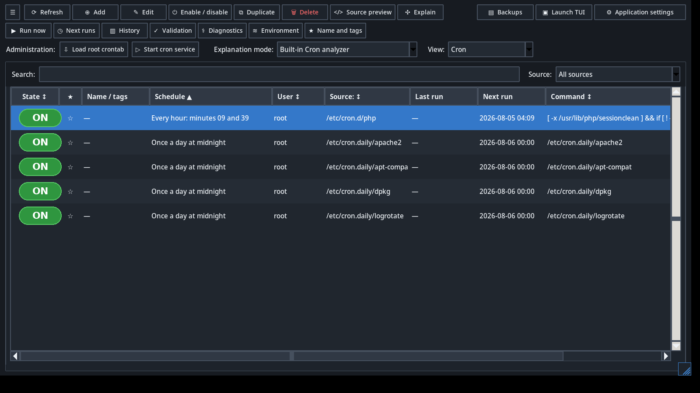
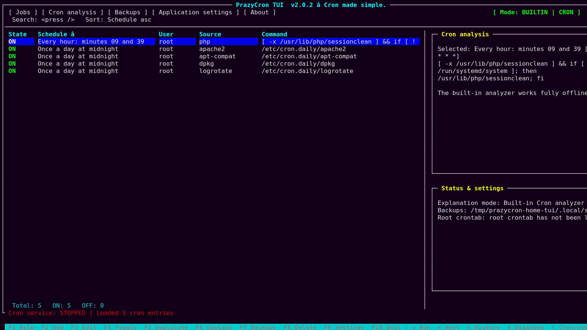

# PrazyCron Task Manager

<p align="center">
  
</p>

<p align="center"><strong>Cron made simple.</strong></p>

<p align="center">
  <a href="https://github.com/Prazynka/prazycron/actions/workflows/ci.yml"></a>
  <a href="https://github.com/Prazynka/prazycron/releases"></a>
  <a href="LICENSE"></a>
  
</p>

PrazyCron is a Linux task scheduler manager with a dark graphical interface and a keyboard-driven terminal interface. It manages Cron jobs and systemd timers, validates changes before saving, creates backups, calculates future runs, records execution history, and diagnoses common scheduling problems.



<details>
<summary>Terminal interface</summary>



</details>

## Highlights

- Manage user and root crontabs, `/etc/crontab`, `/etc/cron.d`, periodic script folders, and systemd timers.
- Dark theme and English interface by default; Polish, German, Spanish, French, Italian, and Ukrainian are selectable.
- Built-in offline Cron analyzer, optional local Ollama integration, and optional OpenAI integration.
- Validate schedules, shell syntax, users, executable paths, permissions, quotes, and risky command patterns.
- Preview a unified diff and create a backup before every Cron modification.
- Show future runs with timezone and daylight-saving-time awareness.
- Run tasks on demand and inspect stdout, stderr, duration, and exit code.
- Record execution history and optionally prevent overlapping runs with `flock`.
- Diagnose service state, ownership, permissions, missing commands, duplicates, and conflicts.
- Edit `SHELL`, `PATH`, `HOME`, `MAILTO`, `CRON_TZ`, and custom variables.
- Use the same `prazycron` command for automatic GUI/TUI selection.

## Supported systems

PrazyCron targets Linux distributions that provide Python 3.10 or newer, Tk, curses, Cron, systemd, PolicyKit, and common GNU utilities. The included `.deb` package is intended for Ubuntu and Debian-family systems. An experimental classic Snap template and a Flatpak evaluation manifest are included for future distribution work.

## Install the DEB package

Download the latest package from [Releases](https://github.com/Prazynka/prazycron/releases), then run:

```bash
cd ~/Downloads
sudo apt install ./prazycron_2.1.0_all.deb
```

## Install from source

```bash
git clone https://github.com/Prazynka/prazycron.git
cd prazycron
sudo ./install.sh
```

## Launch

```bash
prazycron
```

Force a specific interface:

```bash
prazycron --gui
prazycron --tui
```

Useful command-line operations:

```bash
prazycron --list
prazycron --json
prazycron --diagnose
prazycron --systemd-list
prazycron --version
```

## TUI keys

| Key | Action |
|---|---|
| `F2` | Add |
| `F3` | Edit |
| `F4` | Enable or disable |
| `F5` | Duplicate |
| `F6` | Explain |
| `F7` | Backups |
| `F8` | Delete |
| `F9` | Settings |
| `F10` | Quit |
| `x` | Run now |
| `n` | Next runs |
| `h` | History |
| `d` | Diagnostics |
| `c` | Conflicts |
| `e` | Environment |
| `m` | Name, tags, favorite |
| `t` | Switch Cron/systemd view |
| `/` | Search |

## Data locations

```text
~/.config/prazycron/settings.json
~/.local/share/prazycron/backups/
~/.local/share/prazycron/history/
~/.local/share/prazycron/entry-metadata.json
```

## Publish your fork or the official repository

The repository includes an automated publisher that installs/checks the required
tools, opens GitHub authentication when necessary, creates the public repository,
pushes the `main` branch, creates the version tag, runs the release build, and
publishes the release assets.

```bash
./scripts/publish.sh
```

To prepare and publish a later version in one command:

```bash
./scripts/publish.sh 2.1.1
```

The default destination is `Prazynka/prazycron`. Override it with
`PRAZYCRON_GITHUB_OWNER` and `PRAZYCRON_GITHUB_REPO`.

## Development

```bash
python3 -m unittest discover -s tests -v
python3 -m compileall -q prazycron
xvfb-run -a python3 -m prazycron.main --gui --smoke-test
./build-deb.sh
```

More documentation is available in [`docs/`](docs/).

## Security

PrazyCron relies on Linux permissions and PolicyKit for privileged operations. The optional in-app password only protects against accidental changes inside PrazyCron and does not replace administrator authentication. Please report vulnerabilities according to [`SECURITY.md`](SECURITY.md).

## Contributing

Contributions are welcome. Read [`CONTRIBUTING.md`](CONTRIBUTING.md) before opening a pull request.

## License

PrazyCron is available under the [MIT License](LICENSE).
